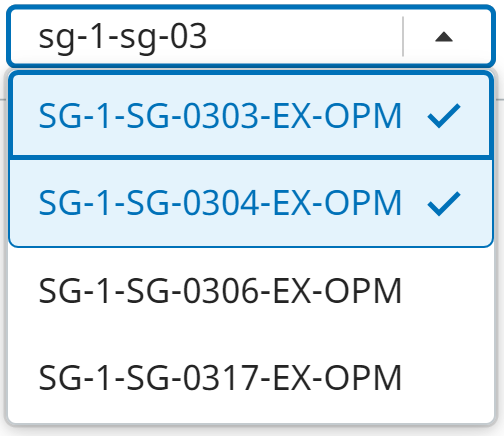
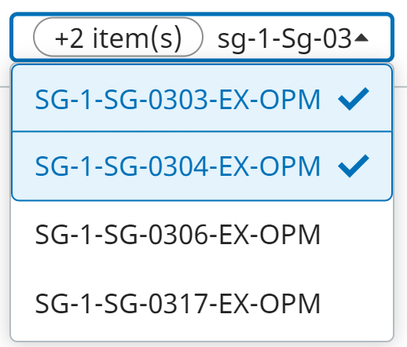

Replaced `react-select` with [iTwinUI's ComboBox](https://itwinui.bentley.com/docs/combobox).

This affects [`PresentationInstanceFilterBuilder`, `NavigationPropertyEditor`] components.

Changes:

- The number of select options is limited to 100. When more items exist, a non-selectable option is displayed at the bottom of the list, prompting users to provide an items filter. Previously, additional pages of select options was loaded when user scrolled to the bottom of the list.

- Old style:
    
    New style:
    

- Deprecated `PortalTargetContext`. It is no longer needed.
