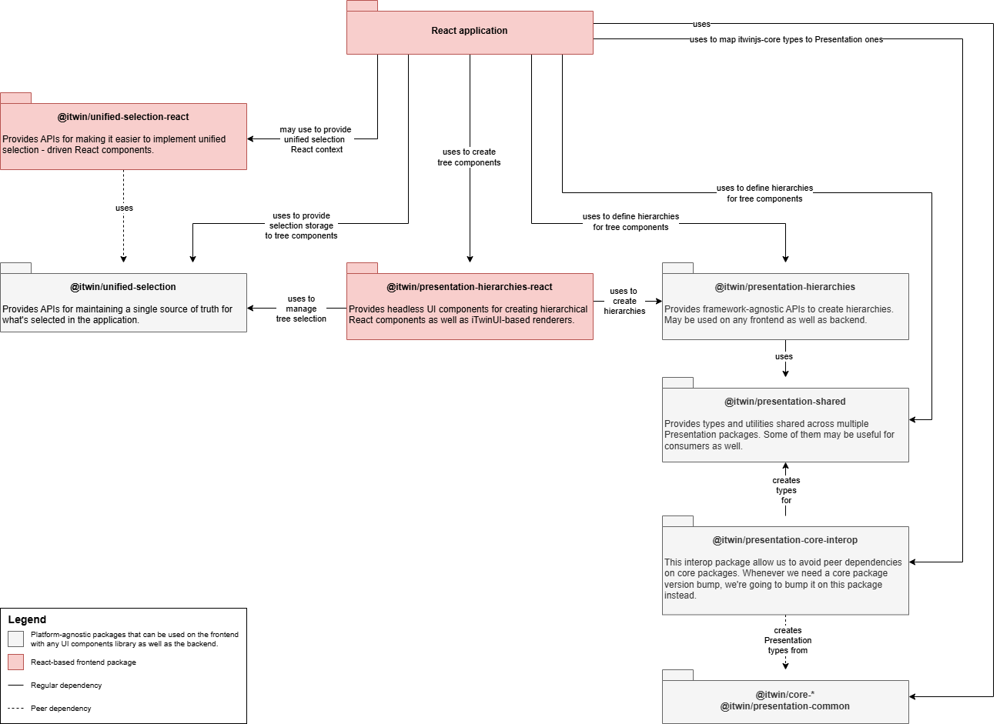

# Presentation

Presentation packages are part of the [iTwin.js library](https://www.itwinjs.org/). The packages' responsibility is to help application developers bring non-graphical [iModels'](https://www.itwinjs.org/learning/imodels/) data to users, by solving the following problems:

- Format property values according to user's preferences (language, locale, unit system, etc.).
- Calculate display labels for instances of different [ECClasses](https://www.itwinjs.org/bis/ec/ec-class/).
- Gather associated data from different areas of an iModel and return it in a way that's easy to present to users.
- Create hierarchies from [iModel](https://www.itwinjs.org/learning/imodels/) (and not only) data.
- Provide components to present non-graphical iModel data to users. This includes tree, table, property grid and some other components and their building blocks, including headless components for use with any UI components library.

## The packages

Initially, all presentation packages were part of the [itwinjs-core](https://github.com/iTwin/itwinjs-core) repository, releasing in lock-step with the core packages. At some point, some of the packages
were moved to this repository, which broke them out of lock-step and allowed them to have their own, much quicker, release cycle. However, the moved packages are still tightly coupled with the ones in
core repository. Both - the Presentation packages in [itwinjs-core](https://github.com/iTwin/itwinjs-core) repository and the ones that we moved to this one - are considered [legacy packages](#legacy-packages).
While the legacy packages are still maintained and contain some APIs that have no replacements, they're gradually being replaced by [new generation packages](#new-generation-packages).

### Legacy packages

| Package                                                                                                                   | Description                                                                                                                                              |
| ------------------------------------------------------------------------------------------------------------------------- | -------------------------------------------------------------------------------------------------------------------------------------------------------- |
| [`@itwin/presentation-common`](https://github.com/iTwin/itwinjs-core/tree/master/presentation/common/README.md)           | Common types and utilities used by other _legacy_ Presentation packages.                                                                                 |
| [`@itwin/presentation-backend`](https://github.com/iTwin/itwinjs-core/tree/master/presentation/backend/README.md)         | APIs for querying presentation data directly from iModels on the backend.                                                                                |
| [`@itwin/presentation-frontend`](https://github.com/iTwin/itwinjs-core/tree/master/presentation/frontend/README.md)       | APIs for querying presentation data from iModels through the [RPC system](https://www.itwinjs.org/learning/rpcinterface/).                               |
| [`@itwin/presentation-components`](https://github.com/iTwin/presentation/tree/master/packages/components/README.md)       | React components and their building blocks to display presentation data to users. Uses `@itwin/presentation-frontend` peer dependency to query the data. |
| [`@itwin/presentation-testing`](https://github.com/iTwin/presentation/tree/master/packages/testing/README.md)             | Utility APIs for testing components based on _legacy_ Presentation APIs.                                                                                 |
| [`@itwin/presentation-opentelemetry`](https://github.com/iTwin/presentation/tree/master/packages/opentelemetry/README.md) | APIs for making interop between OpenTelemetry and _legacy_ Presentation types easier.                                                                    |

### New generation packages

Compared to the legacy packages, the new generation ones are much smaller, have less peer dependencies and are more modular. That makes them easier to consume, as
bumping a version of one package doesn't require bumping the version of other packages or affect unrelated APIs.

The new generation packages can be divided into the following groups:

#### Unified selection

| Package                                                                                                                          | Description                                                                                                                                                                                             | When to use                                                                                        |
| -------------------------------------------------------------------------------------------------------------------------------- | --------------------------------------------------------------------------------------------------------------------------------------------------------------------------------------------------------| ---------------------------------------------------------------------------------------------------|
| [`@itwin/unified-selection`](https://github.com/iTwin/presentation/tree/master/packages/unified-selection/README.md)             | APIs for maintaining a single source of truth for what's selected in an application.                                                                                                                    | You want selection to be synchronized between multiple components in your application.             |
| [`@itwin/unified-selection-react`](https://github.com/iTwin/presentation/tree/master/packages/unified-selection-react/README.md) | React APIs for conveniently using the [@itwin/unified-selection](https://github.com/iTwin/presentation/blob/master/packages/unified-selection/README.md) package in React applications and components.  | You're writing a React application that uses unified selection, and want to make your life easier. |

#### Hierarchies building

| Package                                                                                                                           | Description                                                                                                                                                                                                                                                                         | When to use                                                                                                    |
| --------------------------------------------------------------------------------------------------------------------------------- | ----------------------------------------------------------------------------------------------------------------------------------------------------------------------------------------------------------------------------------------------------------------------------------- | -------------------------------------------------------------------------------------------------------------- |
| [`@itwin/presentation-hierarchies-react`](https://github.com/iTwin/presentation/tree/master/packages/hierarchies-react/README.md) | APIs for building a headless UI for rendering tree components based on data in an [iModel](https://www.itwinjs.org/learning/imodels/). Also contains a set of [iTwinUI](https://github.com/iTwin/iTwinUI/tree/main/packages/itwinui-react)-based components for rendering the tree. | You're creating a React application and want a tree component.                                                 |
| [`@itwin/presentation-hierarchies`](https://github.com/iTwin/presentation/tree/master/packages/hierarchies/README.md)             | APIs for creating hierarchical data structures. The package doesn't depend on any backend, frontend or UI specific packages, which allows it to be used in both backend and frontend applications, and in case of the latter, it can be used with any UI framework.                 | You want to create hierarchical data structures for use cases other than displaying them in a React component. |

#### Utility

| Package                                                                                                                 | Description                                                                                                                                    | When to use                                                                                                                                                                                  |
| ----------------------------------------------------------------------------------------------------------------------- | ---------------------------------------------------------------------------------------------------------------------------------------------- | -------------------------------------------------------------------------------------------------------------------------------------------------------------------------------------------- |
| [`@itwin/presentation-shared`](https://github.com/iTwin/presentation/tree/master/packages/shared/README.md)             | Shared APIs used throughout the _new generation_ Presentation packages. Includes some utilities that may be useful for external consumers too. | You need one of the utilities provided by the package. While most of them are used by the above packages, some might be useful when defining your hierarchies, getting instance labels, etc. |
| [`@itwin/presentation-core-interop`](https://github.com/iTwin/presentation/tree/master/packages/core-interop/README.md) | Interop layer between [itwinjs-core](https://github.com/iTwin/itwinjs-core) and _new generation_ Presentation packages.                        | You're using the above packages within an iTwin.js-based application.                                                                                                                        |

The below diagram shows the typical dependency structure of a React application or component that uses Presentation packages to create a tree component:

## Contribution

If you wish to contribute to this repository, see our [Contributing guide](./CONTRIBUTING.md).
