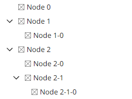

# @itwin/presentation-hierarchies

Copyright © Bentley Systems, Incorporated. All rights reserved. See LICENSE.md for license terms and full copyright notice.

The `@itwin/presentation-hierarchies` package provides APIs for creating hierarchical data structures. While most of the delivered APIs are intended for the use case we anticipate the most - hierarchies based on data in an [iTwin.js iModel](https://www.itwinjs.org/learning/imodels/#imodel-overview), the package also supports generic hierarchies that are not based on any specific data source.

The package doesn't depend on any backend, frontend or UI specific packages. As such, it can be used in both backend and frontend applications, and in case of the latter, it can be used with any UI framework. For React-based frontend applications, please see the [`@itwin/presentation-hierarchies-react`](../hierarchies-react/README.md) package.

## Concepts

A hierarchy is an arrangement of items, called hierarchy nodes, which are represented as being "above", "below", or "at the same level as" one another:



Here are definitions of some basic hierarchy-related concepts based on the above example:

- A hierarchy node is an item in the hierarchy, e.g. `Node 0`, `Node 1`, `Node 1-0` etc.
- A hierarchy level is a group of hierarchy nodes that are at the same level in the hierarchy. In the above example the root level contains `Node 0`, `Node 1` and `Node 2`. Child level of `Node 2` contains `Node 2-0`, `Node 2-1`.
- A hierarchy branch is a sub-hierarchy under specific parent node, including the parent itself. In the above example, the branch of `Node 2` contains `Node 2`, `Node 2-0`, `Node 2-1` and `Node 2-1-0`.

In the context of `@itwin/presentation-hierarchies` package, a hierarchy is built by requesting hierarchy levels from a [hierarchy provider](#hierarchy-providers). A couple of built-in hierarchy provider implementations are delivered with the package - see [hierarchy providers](#hierarchy-providers) section for more information.

### Hierarchy nodes

A `HierarchyNode` data structure in the package represents a single node in a hierarchy. It contains information about what the node represents (through it's `key` property), label and other properties. There are multiple types of nodes:

- A generic node is not based on any iModel data. Its `key` is a `GenericNodeKey` and has a consumer-supplied identifier with an optional `source` attribute identifying the hierarchy provider that created the node.
- An instances node is based on one or more ECInstance(s) in an iModel. Its `key` is an `InstancesNodeKey` and contains identifiers of those ECInstances, in addition to `imodelKey` attribute that identifies the source iModel.
- A grouping node groups one or more instances nodes. Its `key` is a `GroupingNodeKey` and contains the grouping criteria, which depends on the type of grouping:
  - Label grouping node keys have a label.
  - Class grouping nodes have a full class name.
  - Property grouping nodes have a full class name containing the property and property name. Also, depending on whether the grouping is based on value or a range of values, that information is also included.

`HierarchyNode` and `HierarchyNodeKey` namespaces contain type guards and utility functions for working with hierarchy nodes and their keys.

### Hierarchy providers

`HierarchyProvider` is the core concept of the library, which consumers use directly to build hierarchies. While that is an interface [that consumers are free to implement](./learning/CustomHierarchyProviders.md), the package delivers a couple of built-in implementations:

- A provider that builds hierarchies based on data in an [iTwin.js iModel](https://www.itwinjs.org/learning/imodels/#imodel-overview). The `createIModelHierarchyProvider` function is used to create such a provider. See [iModel-based hierarchies](./learning/imodel/HierarchyProvider.md) learning page for more information.

- A merged provider that combines multiple providers into a single one. This is useful when you want to combine multiple hierarchies, possibly built from different data sources, into a single one. See [Merged hierarchies](./learning/MergedHierarchies.md) learning page for more information.

## Learning

Are you migrating from Presentation Rules? Check out our [Migrating from Presentation Rules system](./learning/PresentationRulesMigrationGuide.md) learning page!

Below is a list of learning material related to building hierarchies:

- General topics:
  - [Formatting](./learning/Formatting.md)
  - [Logging](./learning/Logging.md)
  - [Hierarchy filtering](./learning/HierarchyFiltering.md)
  - [Hierarchy level filtering](./learning/HierarchyFiltering.md)
  - [Merged hierarchies](./learning/MergedHierarchies.md)
  - [Custom hierarchy providers](./learning/CustomHierarchyProviders.md)
- iModel-based hierarchies:
  - [Hierarchy provider](./learning/imodel/HierarchyProvider.md)
  - [Hierarchy definition](./learning/imodel/HierarchyDefinition.md)
  - [Hierarchy node labels](./learning/imodel/HierarchyNodeLabels.md)
  - [Hierarchy filtering](./learning/imodel/HierarchyFiltering.md)
  - [Hierarchy level filtering](./learning/imodel/HierarchyLevelFiltering.md)
  - [Grouping](./learning/imodel/Grouping.md)
  - [Localization](./learning/imodel/Localization.md)
  - [Performance tuning](./learning/imodel/PerformanceTuning.md)

Do you think something is missing in the above list? Let us know by [creating an issue](https://github.com/iTwin/presentation/issues/new?assignees=&labels=documentation%2C+presentation&projects=&template=learning-material-request.md&title=).

## Basic example

Here's a simple example of how to create a hierarchy provider and build a hierarchy of iModels' Models and Elements, with the latter grouped by class:

<!-- [[include: [Presentation.Hierarchies.IModelAccessImports, Presentation.Hierarchies.ReadmeExampleImports, Presentation.Hierarchies.IModelAccess, Presentation.Hierarchies.ReadmeExample], ts]] -->
<!-- BEGIN EXTRACTION -->

```ts
import { IModelConnection } from "@itwin/core-frontend";
import { SchemaContext } from "@itwin/ecschema-metadata";
import { ECSchemaRpcLocater } from "@itwin/ecschema-rpcinterface-common";
import { createECSchemaProvider, createECSqlQueryExecutor, createIModelKey } from "@itwin/presentation-core-interop";
import { createLimitingECSqlQueryExecutor } from "@itwin/presentation-hierarchies";
import { createCachingECClassHierarchyInspector, Props } from "@itwin/presentation-shared";

import {
  createIModelHierarchyProvider,
  createNodesQueryClauseFactory,
  createPredicateBasedHierarchyDefinition,
  DefineInstanceNodeChildHierarchyLevelProps,
  HierarchyNode,
  HierarchyProvider,
} from "@itwin/presentation-hierarchies";
import { createBisInstanceLabelSelectClauseFactory, ECSqlBinding } from "@itwin/presentation-shared";

// Not really part of the package, but we need SchemaContext to create a hierarchy provider. It's
// recommended to cache the schema context and reuse it across different application's components to
// avoid loading and storing same schemas multiple times.
const imodelSchemaContextsCache = new Map<string, SchemaContext>();
function getIModelSchemaContext(imodel: IModelConnection) {
  const imodelKey = createIModelKey(imodel);
  let context = imodelSchemaContextsCache.get(imodelKey);
  if (!context) {
    context = new SchemaContext();
    context.addLocater(new ECSchemaRpcLocater(imodel.getRpcProps()));
    imodelSchemaContextsCache.set(imodelKey, context);
    imodel.onClose.addListener(() => imodelSchemaContextsCache.delete(imodelKey));
  }
  return context;
}

function createIModelAccess(imodel: IModelConnection) {
  const schemaProvider = createECSchemaProvider(getIModelSchemaContext(imodel));
  return {
    // The key of the iModel we're accessing
    imodelKey: createIModelKey(imodel),
    // Schema provider provides access to EC information (metadata)
    ...schemaProvider,
    // While caching for hierarchy inspector is not mandatory, it's recommended to use it to improve performance
    ...createCachingECClassHierarchyInspector({ schemaProvider, cacheSize: 100 }),
    // The second argument is the maximum number of rows the executor will return - this allows us to
    // avoid creating hierarchy levels of insane size (expensive to us and useless to users)
    ...createLimitingECSqlQueryExecutor(createECSqlQueryExecutor(imodel), 1000),
  };
}

function createProvider(imodelAccess: Props<typeof createIModelHierarchyProvider>["imodelAccess"]): HierarchyProvider {
  // Create a factory for building labels SELECT query clauses according to BIS conventions
  const labelsQueryFactory = createBisInstanceLabelSelectClauseFactory({ classHierarchyInspector: imodelAccess });

  // Create a factory for building nodes SELECT query clauses in a format understood by the provider
  const nodesQueryFactory = createNodesQueryClauseFactory({ imodelAccess, instanceLabelSelectClauseFactory: labelsQueryFactory });

  // Then, define the hierarchy
  const hierarchyDefinition = createPredicateBasedHierarchyDefinition({
    classHierarchyInspector: imodelAccess,
    hierarchy: {
      // For root nodes, select all BisCore.GeometricModel3d instances
      rootNodes: async () => [
        {
          fullClassName: "BisCore.GeometricModel3d",
          query: {
            ecsql: `
              SELECT
                ${await nodesQueryFactory.createSelectClause({
                  ecClassId: { selector: "this.ECClassId" },
                  ecInstanceId: { selector: "this.ECInstanceId" },
                  nodeLabel: {
                    selector: await labelsQueryFactory.createSelectClause({ classAlias: "this", className: "BisCore.GeometricModel3d" }),
                  },
                })}
              FROM BisCore.GeometricModel3d this
            `,
          },
        },
      ],
      childNodes: [
        {
          // For BisCore.Model parent nodes, select all BisCore.Element instances contained in corresponding model
          parentInstancesNodePredicate: "BisCore.Model",
          definitions: async ({ parentNodeInstanceIds }: DefineInstanceNodeChildHierarchyLevelProps) => [
            {
              fullClassName: "BisCore.Element",
              query: {
                ecsql: `
                  SELECT
                    ${await nodesQueryFactory.createSelectClause({
                      ecClassId: { selector: "this.ECClassId" },
                      ecInstanceId: { selector: "this.ECInstanceId" },
                      nodeLabel: {
                        selector: await labelsQueryFactory.createSelectClause({ classAlias: "this", className: "BisCore.Element" }),
                      },
                      grouping: {
                        byClass: true,
                      },
                    })}
                  FROM BisCore.Element this
                  WHERE this.Model.Id IN (${parentNodeInstanceIds.map(() => "?").join(",")})
                `,
                bindings: [...parentNodeInstanceIds.map((id): ECSqlBinding => ({ type: "id", value: id }))],
              },
            },
          ],
        },
      ],
    },
  });

  // Finally, create the provider
  return createIModelHierarchyProvider({ imodelAccess, hierarchyDefinition });
}

async function main() {
  const provider = createProvider(createIModelAccess(await getIModelConnection()));
  async function loadBranch(parentNode: HierarchyNode | undefined, indent: number = 0) {
    for await (const node of provider.getNodes({ parentNode })) {
      console.log(`${new Array(indent * 2 + 1).join(" ")}${node.label}`);
      await loadBranch(node, indent + 1);
    }
  }
  await loadBranch(undefined);
}
```

<!-- END EXTRACTION -->
